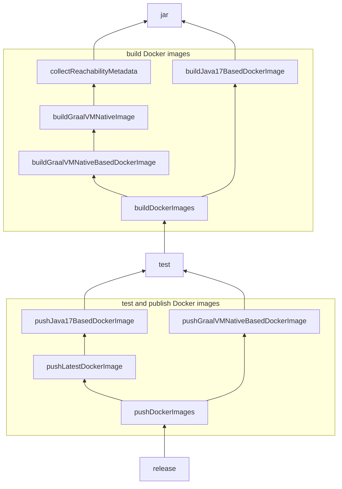

## LocalS3 Docker Image

LocalS3 provides two types of Docker images: `local-s3` and `local-s3-native`. The executable in `local-s3` is a Java application that runs on Java 17, 
while the executable in `local-s3-native` is build using GraalVM. The `local-s3-native` image is much smaller than the `local-s3` image.

### Gradle tasks

This module contains several Gradle tasks to build and publish the Docker images.

### Collect reachability metadata

+ `buildCollectReachabilityMetadataImage` - Builds the Docker image for collecting reachability metadata.
+ `collectReachabilityMetadata` - Collects reachability metadata for building the GraalVM native image.

Above tasks are not integrated in the CI pipeline. We need to manually run the `collectReachabilityMetadata` task.
Collected reachability metadata files in `build/graalvm-native-image/reachability-metadata` are used to build the GraalVM native image.




`collectReachbilityMetadata` - Collects reachability metadata for building the GraalVM native image. 

```mermaid
graph TD;

  

```